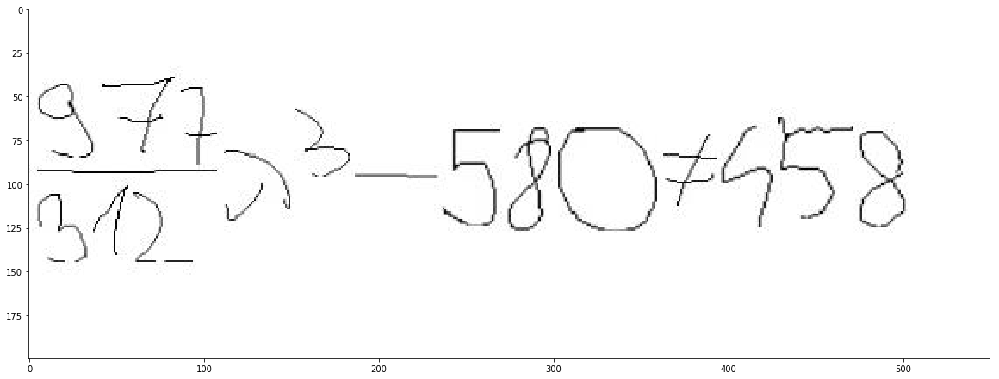

# HE2LaTeX

The main goal of this repository is to provide a framework of constructing LaTeX equations out of handwritten images.

Converting this:


to:

```
$\frac{977}{312}\lambda^3-580 \neq 458$
```

A short test can be done using the jupyter notebook [short_test.ipynb](short_test.ipynb).

For downloading all data needed for training run:

```
python download.py
```

The sequence to sequence model can be trained using the jupyter notebook [Seq2Seq.ipynb](Seq2Seq.ipynb) where also the model used is shown.

If the model itself changed the file `Seq2SeqModel/Seq2SeqModel.py` has to be changed as well.